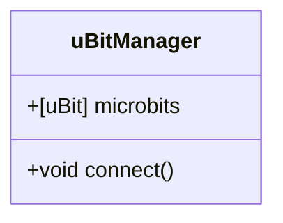

# Overview

This provides an API for interacting with the micro:bit's log over Bluetooth via WebBLE.  It also includes a demo application to show how it works.

# Files / Manifest

* `ubitwebblelog.js`: The actual API (the only file needed for other applications)
* Demo application (a web-based console that shows the different messages)
  * [`index.html`](https://github.com/bsiever/microbit-webblelog/blob/master/index.html):  HTML with in-line JavaScript for the application
    * [View Live Version](https://bsiever.github.io/microbit-webblelog/) *Only works in Chrome*
    * [View Local Live Version](./index.html) *Only works in Chrome*
  * `style.css`
  * Requires `ubitwebblelog.js`
* Documentation files
  * [`readme.md`](https://github.com/bsiever/microbit-webblelog/blob/master/readme.md): Overview of project
  * [`docs`](https://bsiever.github.io/microbit-webblelog/docs/): Directory including JSDoc documentation
    * `jsdoc.md`: Initial page / readme for JSDocs
  * `_config.yml`: GitHub pages config
  * [`LICENSE`](./LICENSE): MIT License

## Micro:bit configuration (Pre-CODAL Update)

At this time (2022-02-06) the version of CODAL supported in MakeCode does not include `uBit.log.readData()` needed to read log data.  A newer (alpha) version of MakeCode must be used for the Bluetooth Extension.

* Go to https://makecode.microbit.org/app/62bd528c2aa51e6342a764c506492937d31ba568-a9bfe06ee6 (which uses CODAL v0.2.48)
* Create a new project
* Add the BLELog extension
  * + Extensions
  * Paste the URL: https://github.com/bsiever/microbit-pxt-blelog in the search field and hit enter
  * Click on the tile to add the extension.
  * You'll asked to confirm removal of the `radio` blocks (and add this extension).  Click on the `Remove ...` button.
* Add the `Data Logger Bluetooth`'s `bluetooth data logger service` to the `on start` handler
* Add `data logger`'s `set columns` to the `on start` handler too.  
  * Add in the names of the fields (columns) 
* Add other handlers that support data points and/or erasing the log. 

```
input.onButtonPressed(Button.A, function () {
    datalogger.log(
    datalogger.createCV("x", input.acceleration(Dimension.X)),
    datalogger.createCV("y", input.acceleration(Dimension.Y))
    )
})
input.onButtonPressed(Button.AB, function () {
    datalogger.deleteLog(datalogger.DeleteType.Fast)
})
blelog.startBLELogService()
datalogger.setColumnTitles(
"x",
"y"
)
```

## Program the Micro:bit from Shared Project

* Example Project: https://makecode.microbit.org/_DLCFDW5WF11
* Another example: https://makecode.microbit.org/_YLPW2ehesbM1


# API

# Events 

* "connected":  data.detail is the device that connected
  * {detail: {device: this}}
* "disconnected": data.detail.device is the device that disconnected
  * {device:this}
* "log usage":
  * {detail: {device: this, percent: value}}
* "progress": data.detail.device is device.  data.detail.progress is progress (0-100)
  *  {device:this, progress:progress} 
* "data ready" New data is ready (the length of the log has changed.  Final values, including time stamps are included)
  * {detail: {device: this}}
* "unauthorized" : data.detail is device that needs valid password
  * {detail: {device: this}}
* "graph-cleared":  data.detail is the device that connected
  * {detail: {device: this}}
* "row-updated":
  * {detail: {device: this, row: rowIndex, data: this.rows[rowIndex], headers: this.fullHeaders}}


## uBitManager



## Summary

TODO

## JSDocs: Documentation on the functions

[JSDocs Here](https://bsiever.github.io/microbit-webblelog/docs/index.html)

## Example

See [`index.html`](./index.html) for a complete example application.


# TODO Log

1. set/get uBit label
2. Initial load: Only new data
3. Parsing data and adding time stamps
4. In onNewLength:  If length == 0 (reset), erase store 
5. Cleanup / checking
6. Retrieval of all data
7. Docs.
8. Disconnect should terminate any pending "progress" stuff???


## JSDoc 

jsdoc ubitwebblelog.js -r jsdoc.md -d docs