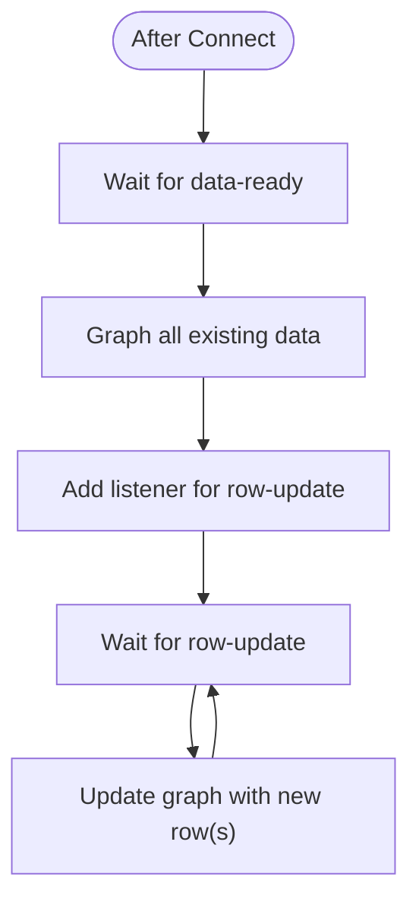
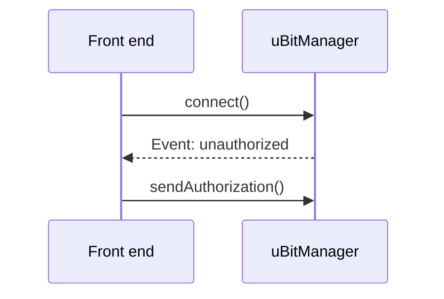

# Overview

This provides an API for interacting with the micro:bit's log over Bluetooth via WebBLE.  It also includes a demo application to show how it works.

# Files / Manifest

* `ubitwebblelog.js`: The actual API (the only file needed for other applications)
* Demo application (a web-based console that shows the different messages)
  * [`index.html`](https://github.com/bsiever/microbit-webblelog/blob/master/index.html):  HTML with in-line JavaScript for the application
    * [View Live Version](https://bsiever.github.io/microbit-webblelog/) *Only works in Chrome*
    * [View Local Live Version](./index.html) *Only works in Chrome*
  * `style.css`
  * Requires `ubitwebblelog.js`
* Documentation files
  * [`readme.md`](https://github.com/bsiever/microbit-webblelog/blob/master/readme.md): Overview of project
  * [`docs`](https://bsiever.github.io/microbit-webblelog/docs/): Directory including JSDoc documentation
    * `jsdoc.md`: Initial page / readme for JSDocs
  * `_config.yml`: GitHub pages config
  * [`LICENSE`](./LICENSE): MIT License

## Micro:bit configuration (Pre-CODAL Update)

At this time (2022-02-06) the version of CODAL supported in MakeCode does not include `uBit.log.readData()` needed to read log data.  A newer (alpha) version of MakeCode must be used for the Bluetooth Extension.

* Go to https://makecode.microbit.org/app/62bd528c2aa51e6342a764c506492937d31ba568-a9bfe06ee6 (which uses CODAL v0.2.48)
* Create a new project
* Add the BLELog extension
  * + Extensions
  * Paste the URL: https://github.com/bsiever/microbit-pxt-blelog in the search field and hit enter
  * Click on the tile to add the extension.
  * You'll asked to confirm removal of the `radio` blocks (and add this extension).  Click on the `Remove ...` button.
* Add the `Data Logger Bluetooth`'s `bluetooth data logger service` to the `on start` handler
* Add `data logger`'s `set columns` to the `on start` handler too.  
  * Add in the names of the fields (columns) 
* Add other handlers that support data points and/or erasing the log. 

```
input.onButtonPressed(Button.A, function () {
    datalogger.log(
    datalogger.createCV("x", input.acceleration(Dimension.X)),
    datalogger.createCV("y", input.acceleration(Dimension.Y))
    )
})
input.onButtonPressed(Button.AB, function () {
    datalogger.deleteLog(datalogger.DeleteType.Fast)
})
blelog.startBLELogService()
datalogger.setColumnTitles(
"x",
"y"
)
```

## Program the Micro:bit from Shared Project

* Example Project: https://makecode.microbit.org/_DLCFDW5WF11
* Another example: https://makecode.microbit.org/_YLPW2ehesbM1


# API

## Objects

* `uBitManager`:  A single `uBitManager` should be created for any application.  It is used to connect to and manage available micro:bit data loggers.  All events for individual micro:bits are sent via the manager.
* `uBit`: A single micro:bit object.  It provides operations to change its label, refresh all it's data, remove it, etc. 

A typical application will:

1. Create a single `uBitManager` instance.
2. Register with it for events of interest.
3. Allow users to call the `uBitManager`'s `connect()` to connect to micro:bit data loggers.
4. Allow interactions via:
   * Responding to any incoming events (i.e., graph or log data)
   * Allowing users to call operations on individual micro:bits (`refresh()` data, `erase()`, etc.) 

## Class Diagrams


## Connection Process

### Checking Password

If a password is not needed or a successful password is already saved, after connection it will proceed on to retrieve all new data (After Security Confirmation process).  Otherwise the `sendAuthorization()` must be used to send a password to get access.


### After Security Confirmation

After gaining authorization to access data, the data that was acquired since the last connection is retrieved.


Multiple `progress` and `row-updated` events will occur while data is being retrieved.  The UTC timestamps will not be known until all data has been retrieved (after `data-ready`).

## An approach for graphing




## Sequences

### Connection


## Security access



If the password is invalid there will be another `unauthorize` event.  Otherwise it will proceed to retrieve data from the micro:bit.

## JSDocs: Documentation on the functions

[JSDocs Here](https://bsiever.github.io/microbit-webblelog/docs/index.html)

### Regenerate

```
jsdoc ubitwebblelog.js -r jsdoc.md -d docs
```

## Example

See [`index.html`](./index.html) for a complete example application.

# TODO Log

* Finish docs / sequence diagrams
* Finish testing persistent storage and enable it.
* More testing.
  * Multiple devices.
* Try to speed up initial download:
  * https://punchthrough.com/ble-throughput-part-4/

